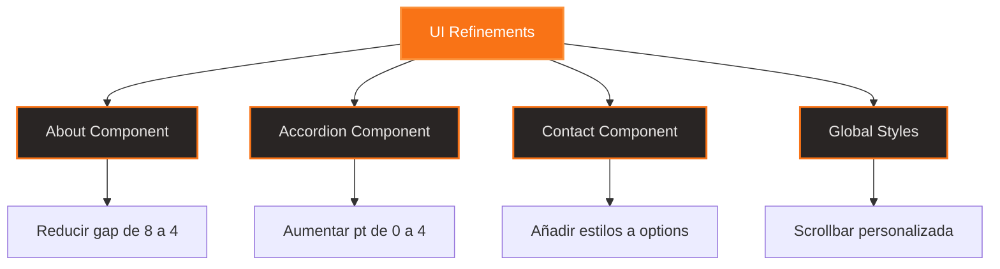

# Documento de Diseño

## Overview

Este documento detalla el diseño técnico para implementar tres ajustes visuales menores en el sitio web de Chill Chess Club. Los cambios se enfocan en mejorar la armonía visual mediante ajustes de espaciado, padding y estilos de elementos de formulario para mantener la coherencia con el tema neumórfico sunset existente.

## Architecture

### Componentes Afectados

1. **About.tsx** (`app/[locale]/components/About.tsx`)

   - Ajuste de espaciado en el grid de 2 columnas
   - Modificación de la propiedad `gap` en el contenedor principal

2. **accordion.tsx** (`components/ui/accordion.tsx`)

   - Ajuste de padding en `AccordionContent`
   - Modificación del espaciado superior del contenido expandido

3. **Contact.tsx** (`app/[locale]/components/Contact.tsx`)

   - Estilos personalizados para el elemento `<select>`
   - Aplicación de colores del tema a las opciones del dropdown

4. **globals.css** (`app/globals.css`)
   - Estilos globales para scrollbar personalizada
   - Uso de pseudo-elementos webkit para navegadores compatibles

### Estrategia de Implementación

Los cambios son independientes entre sí y pueden implementarse en cualquier orden. Cada ajuste es mínimamente invasivo y no afecta la funcionalidad existente, solo mejora la presentación visual.

## Components and Interfaces

### 1. About Component - Ajuste de Espaciado

**Archivo:** `app/[locale]/components/About.tsx`

**Cambio Específico:**

```tsx
// Línea actual (~52):
<div className="grid md:grid-cols-2 gap-8 items-center mb-16">

// Cambiar a:
<div className="grid md:grid-cols-2 gap-4 items-center mb-16">
```

**Justificación:**

- Reducir `gap-8` (2rem/32px) a `gap-4` (1rem/16px) acerca la imagen al texto
- Solo afecta la vista de escritorio (md breakpoint y superior)
- Mantiene el espaciado vertical en móviles sin cambios

### 2. Accordion Component - Padding Superior

**Archivo:** `components/ui/accordion.tsx`

**Cambio Específico:**

```tsx
// Línea actual (~52):
<div className={cn("px-6 pb-5 pt-0", className)}>{children}</div>

// Cambiar a:
<div className={cn("px-6 pb-5 pt-4", className)}>{children}</div>
```

**Justificación:**

- Cambiar `pt-0` a `pt-4` (1rem/16px) añade espacio superior
- Permite que el degradado del trigger sea visible cuando el contenido se expande
- Mejora la legibilidad al separar el contenido del borde superior

**Consideración Adicional:**
Si el degradado aún no es suficientemente visible, podemos añadir un borde decorativo:

```tsx
<div
  className={cn("px-6 pb-5 pt-4 border-t-2 border-sunset-500/20", className)}
>
  {children}
</div>
```

### 3. Contact Component - Dropdown Styling

**Archivo:** `app/[locale]/components/Contact.tsx`

**Cambio Específico:**
El elemento `<select>` ya tiene clases base correctas. Necesitamos añadir estilos específicos para las opciones:

```tsx
// Línea actual (~115-125):
<select
  {...register("subject")}
  id="subject"
  className="w-full px-4 py-3 bg-warmGray-800 border border-warmGray-600 rounded-lg focus:border-sunset-500 focus:ring-2 focus:ring-sunset-500/20 outline-none transition-all text-warmGray-100 shadow-neumorphic-inset-sm"
>
  <option value="">{t("form.subjectPlaceholder")}</option>
  {/* ... opciones ... */}
</select>

// Añadir estilos inline para las opciones:
<select
  {...register("subject")}
  id="subject"
  className="w-full px-4 py-3 bg-warmGray-800 border border-warmGray-600 rounded-lg focus:border-sunset-500 focus:ring-2 focus:ring-sunset-500/20 outline-none transition-all text-warmGray-100 shadow-neumorphic-inset-sm [&>option]:bg-warmGray-800 [&>option]:text-warmGray-100 [&>option:checked]:bg-sunset-500 [&>option:hover]:bg-warmGray-700"
>
  <option value="">{t("form.subjectPlaceholder")}</option>
  {/* ... opciones ... */}
</select>
```

**Justificación:**

- Usa selectores arbitrarios de Tailwind para estilizar elementos `<option>`
- Mantiene consistencia con el tema warmGray
- Añade color de acento sunset para estados activos

**Limitación:**
Los estilos de `<option>` son limitados por el navegador. Para un control total, se requeriría un componente custom dropdown (fuera del alcance de este ajuste menor).

### 4. Global Scrollbar Styling

**Archivo:** `app/globals.css`

**Cambio Específico:**
Añadir al final del archivo:

```css
/* Custom Scrollbar Styles */
::-webkit-scrollbar {
  width: 12px;
  height: 12px;
}

::-webkit-scrollbar-track {
  background: #292524; /* warmGray-800 */
  border-radius: 6px;
}

::-webkit-scrollbar-thumb {
  background: #f97316; /* sunset-500 */
  border-radius: 6px;
  border: 2px solid #292524; /* warmGray-800 */
  transition: background 0.3s ease;
}

::-webkit-scrollbar-thumb:hover {
  background: #fb923c; /* sunset-400 */
}

/* Firefox Scrollbar */
* {
  scrollbar-width: thin;
  scrollbar-color: #f97316 #292524; /* thumb track */
}
```

**Justificación:**

- Usa pseudo-elementos webkit para Chrome/Safari/Edge
- Usa propiedades estándar para Firefox
- Colores consistentes con el tema warmGray y sunset
- Efecto hover para mejorar la interactividad

## Data Models

No aplica - estos cambios son puramente visuales y no afectan modelos de datos.

## Error Handling

No aplica - estos cambios no introducen nueva lógica que pueda fallar. Son ajustes de CSS/clases de Tailwind.

## Testing Strategy

### Pruebas Visuales Manuales

1. **About Section:**

   - Verificar en desktop (>768px) que el gap se redujo
   - Verificar en mobile que el layout vertical no cambió
   - Confirmar que la imagen y texto se ven más cohesivos

2. **FAQ Accordion:**

   - Expandir cada pregunta y verificar el padding superior
   - Confirmar que el degradado/borde superior es visible
   - Verificar que la animación de expansión sigue siendo suave

3. **Contact Form Dropdown:**

   - Abrir el dropdown y verificar colores de opciones
   - Verificar hover states (si el navegador lo permite)
   - Confirmar que el dropdown es legible y coherente con el tema

4. **Scrollbar:**
   - Navegar a secciones con scroll (FAQ, Contact message textarea)
   - Verificar colores del track y thumb
   - Probar hover effect en el thumb
   - Verificar en Chrome, Firefox, Safari, Edge

### Navegadores a Probar

- Chrome/Edge (webkit scrollbar)
- Firefox (scrollbar estándar)
- Safari (webkit scrollbar)

### Responsive Testing

- Mobile: < 768px
- Tablet: 768px - 1024px
- Desktop: > 1024px

## Diagrama de Cambios



## Consideraciones de Diseño

### Consistencia Visual

Todos los cambios mantienen la coherencia con el sistema de diseño existente:

- Paleta warmGray para fondos y textos
- Color sunset-500 como acento principal
- Espaciado basado en la escala de Tailwind (múltiplos de 0.25rem)

### Accesibilidad

- Los cambios de espaciado no afectan la legibilidad
- Los colores del dropdown mantienen suficiente contraste
- La scrollbar personalizada es visible y funcional

### Performance

- Cambios puramente CSS, sin impacto en performance
- No se añaden dependencias ni JavaScript adicional
- Los estilos de scrollbar son nativos del navegador

### Compatibilidad

- Scrollbar webkit: Chrome, Safari, Edge (>90% de usuarios)
- Scrollbar estándar: Firefox
- Fallback: scrollbar por defecto del navegador en navegadores antiguos
